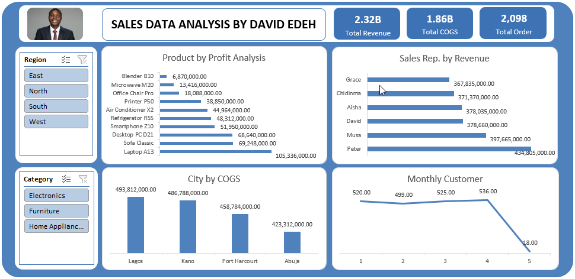

# Sales Data Analysis Dashboard


## Project Overview

This project is an Excel-based sales analytics dashboard. The project analyzes sales performance data to uncover business insights related to profitability, revenue generation, customer trends, and operational performance.

The dashboard was designed to transform raw transactional sales data into actionable insights for business decision-making.

---

## Business Problem

Businesses generate large amounts of sales data daily, but raw data alone does not provide meaningful insights for decision-making. This project aims to answer key business questions such as:

- Which products generate the highest profit?
- Which sales representatives contribute the most revenue?
- Which cities incur the highest cost of goods sold (COGS)?
- What are the monthly customer trends?
- Which months perform best and worst in customer activity?

---

## Objectives

The objectives of this project were to:

- Clean and prepare raw sales data for analysis
- Perform revenue and profitability analysis
- Identify high-performing products and sales representatives
- Analyze city-level operational costs
- Evaluate customer trends across different months
- Build an interactive Excel dashboard for business reporting

---

## Tools Used

- Microsoft Excel
- Pivot Tables
- Pivot Charts
- Excel Formulas and Functions
- Data Visualization Techniques
- Interactive Slicers

---

## Dataset Description

The dataset contains transactional sales records including:

- Product information
- Sales representatives
- Revenue
- Cost of Goods Sold (COGS)
- Customer information
- Regional data
- Monthly sales records

The original dataset contained columns A–J, while additional business metrics (columns K–O), including Revenue, COGS, Profit, and Month categorization were derived from the original sales dataset using Excel formulas and analytical techniques.

---

## Data Cleaning and Preparation

The following steps were performed during data preparation:

- Checked for missing values
- Standardized formatting
- Created calculated columns using Excel formulas
- Organized data for pivot table analysis
- Prepared data for dashboard visualization

---

## Analysis Performed

### 1. Product by Profit Analysis
This analysis identified the most profitable products based on total profit generated.

### 2. Sales Representative by Revenue
This analysis evaluated sales representatives based on total revenue contribution.

### 3. City by Cost of Goods Sold (COGS)
This analysis examined operational cost distribution across cities.

### 4. Monthly Customer Trend Analysis
This analysis tracked customer activity trends across months to identify peak and low-performing periods.

---

## Key Insights

- Laptop A13 generated the highest product profit among analyzed products.
- Peter recorded the highest revenue among sales representatives.
- Lagos had the highest Cost of Goods Sold (COGS).
- April recorded the highest customer activity, while May showed a sharp decline.

---

## Dashboard Features

The dashboard includes:

- KPI Cards
  - Total Revenue
  - Total COGS
  - Total Orders

- Interactive Slicers
  - Region Filter
  - Product Category Filter

- Dynamic Charts
  - Product Profit Analysis
  - Sales Representative Revenue Analysis
  - City-Level COGS Analysis
  - Monthly Customer Trend Analysis

---

## Recommendations

Based on the analysis, the following recommendations were made:

- Increase focus on high-profit products such as Laptop A13.
- Investigate the factors contributing to Peter’s strong sales performance and replicate successful strategies across the sales team.
- Review operational expenses in Lagos to optimize COGS.
- Investigate the significant decline in customer activity during May.
- Expand marketing efforts during high-performing periods to maximize revenue opportunities.

---

## Dashboard Preview


---

## Project Structure

```text
Sales-data-analysis-dashboard/
│
├── README.md
├── data/
├── analysis/
├── visuals/
```

---

## Files Included

- Raw sales dataset
- Excel analysis workbook
- Dashboard preview image

---

## Author

David Edeh

<a href="https://github.com/DavidEdeh22"><kbd>Visit My GitHub Profile</kbd></a>
<a href="http://www.linkedin.com/in/david-edeh-84aa65232"><kbd>Visit My LinkedIn Profile</kbd></a>

---
